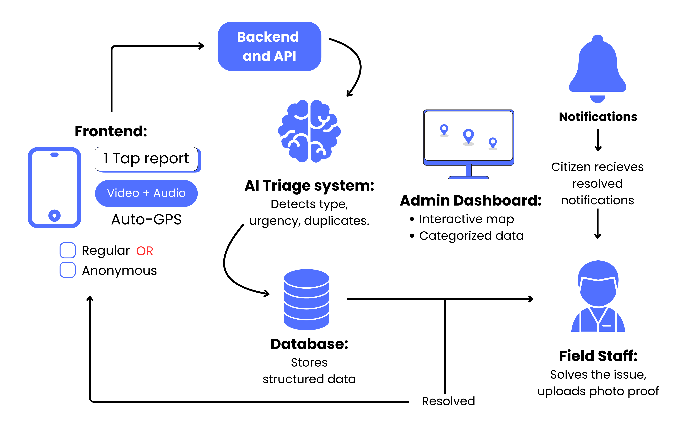

# Sahaay - Your Voice For A Better City!

**Hackathon:** Smart India Hackathon (SIH)

## Overview

**Sahaay** is a crowdsourced civic issue reporting and resolution system  that uses a simple PWA and an AI Triage Engine to bridge the communication gap between citizens and municipal authorities, making the process fast, transparent, and efficient.

This project was developed for the **Smart India Hackathon (SIH)** and focuses on simplifying complex tasks with minimal user interaction.

---

## Features

- **One-Tap Report**: Users can report with a single tap.
- **Real-Time Detection**: Uses **YOLO (You Only Look Once)** for object detection on live video streams.
- **Database Integration**: Predicted results are stored in a backend database for record-keeping and analytics.
- **Admin Dashboard**: Visualizes predictions and analytics, enabling efficient monitoring and decision-making.
- **Scalable Architecture**: Modular design allows easy integration with other systems or models.

---

## Architecture

  
*The system captures video, processes it with the YOLO model, stores predictions in the database, and displays insights on the admin dashboard.*

---

## Tech Stack

- **Backend:** FastAPI 
- **Frontend:** React.js 
- **AI/ML:** YOLO (Real-Time Object Detection)
- **Database:** PostgreSQL 
- **Deployment:** Docker 

---

## Installation

1. Clone the repository:

bash 
git clone https://github.com/yourusername/sahaay.git 
cd sahaay

---

## Install Python dependencies

pip install -r requirements.txt 

---

## Run the backend server

python app.py 

---

## Launch the frontend dashboard

cd frontend 
npm install 
npm start 

---

## Usage

1. Open the dashboard in your browser.
2. Tap the **Start Detection** button to activate the model.
3. The system will process video in real-time and update predictions to the dashboard.
4. Admins can view and manage alerts or analytics directly from the dashboard.

---

## Model Details

-**Model:** YOLOv8 
-**Training Data:** Custom dataset collected for the problem scenario 
-**Output:** Prediction labels with bounding boxes and confidence scores 
-**Integration:** Backend API receives predictions and updates the database 

---

## Project Status

-✅ Real-time detection working 
-✅ Database integration functional 
-✅ Admin dashboard operational 
-🔄 Deployment pending 

---

## Contribution

We welcome contributions to improve the system! Please fork the repo, create a branch, and submit a pull request.

---

## Contact
Team J.A.R.V.I.S 
GitHub: https://github.com/prachishende007 
